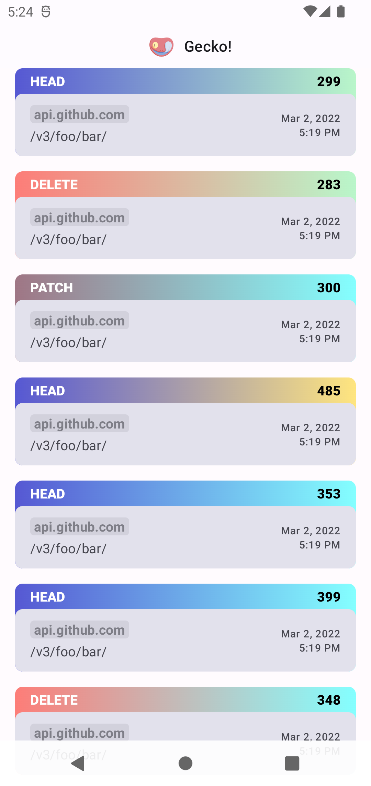
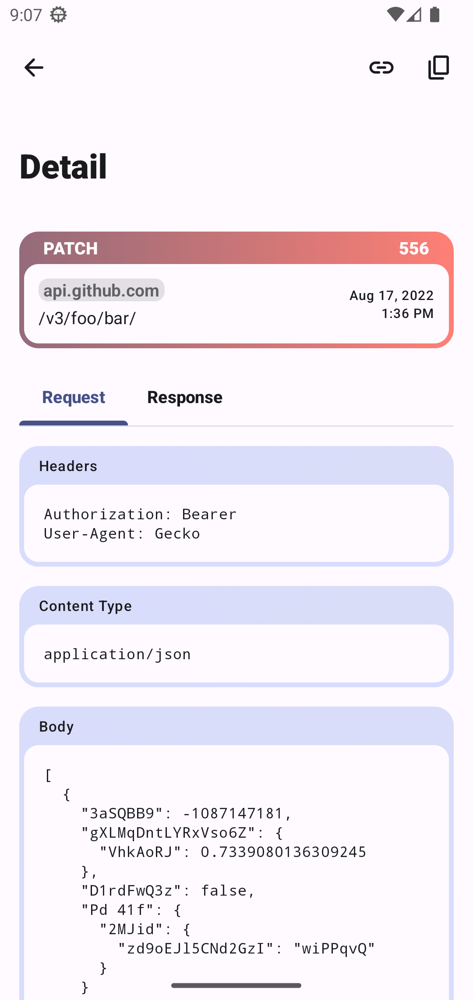

<p align="center">
  
</p>
<h1 align="center">Gecko</h1>
<p align="center">
   <a href="https://www.codacy.com/gh/diareuse/gecko/dashboard?utm_source=github.com&amp;utm_medium=referral&amp;utm_content=diareuse/gecko&amp;utm_campaign=Badge_Grade">
      
   </a>
</p>

Gecko is a toolchain allowing for somewhat more pleasant development of API features. Its own
features vary by platform, where Android is getting the most love and a standalone application which
saves all content of all given requests/responses for later debugging.

## How does it work?

1) accepts metadata
   1) `GeckoMetadata[foo=bar,…]`
2) serializes them
   1) `M=bar…`
3) compresses them
   1) `????P?…`
4) base64 encodes them
   1) `gg3QH2Q==`
5) builds an url
   1) `https://diareuse.github.io/gecko/?q=gg3QH2Q==`
6) prints to output
   1) `V/System.out: https://diareuse.github.io/gecko/?q=gg3QH2Q==`

The frontend does the exact reverse and nothing more. You can check
the [repository](https://github.com/diareuse/gecko-fe) for more info.

You can always
just [try it out](https://diareuse.github.io/gecko/?q=H4sIAAAAAAAAAJ1UXW_aMBSVkj3xKyIet1ETQlmH1Id2rVRNZfSDbVVfkONcErdJbNlOKEP8912HhBYmoVEpL7m559xzjnPtZDfj-4nrFIkxUg8JoZIfxdwkRXjEREZiro0mfi_oHw8IFjLIjXad5IwxkGZIpUw5o4aLnJR51CDL4NOTFrnrpIPAdczbrnU9XLY8r23JpzxqD732ekL7sy2HIlrY2mjh6UKC8ugctMjAq-e3WyvXYb2u7zojpoAaiFxHXk0mN6TnOlcPnStIUzH8OKcl6I-te9AaJw_hhWYyhY5ev3eYEM8cXOfaD7p915n8q_K8UlkJ9CtluYigFjy6uHwZP0eSBXcXYc83j7-Pu6Pb09O1hUKltmlvqHQQhd0QWDDohuHJF_ja9082ERN_O4vvhTaNf57H3kwozyTgafoMnpi9-VQL0KAQZw3gWypinlsawYxAi1XPlrVdc7eDXw8_UvZ0edr00pIaqqY7zt644hmNQRNQSihSD5ommOoCvc8amljVROtJTXl_YNaNJjviE5Ole-TsdM8E_hNzpNmF7BtFNqhtGoz5HTSIWhKBp4Yp4ufVJhL7OxzEVyGWpN6fDZHGXBVEB1HVGBQ2z1HTkiiQ4pWxCDVTXNqlOEziFrKhEyqmOf9DD6dD5IbFKjwMXSEaOJR2wQ7CryFLIhUvKVusXpUw4CUm_g7OHWxDaRYSLMdPu8DNKXADUxpl1Q7PaKoB66tqz-v7b4o_OoLwTvQ73X7HP5n0giE-x4PH-j6Q0X_10cIkQk2p1oLx6pxs_7fx9fXZ-fjubDK-w9u35X74C9iU9Ts4BgAA)

<p float="left">
    
    
</p>

# Links!

- Visit our [Wiki](https://github.com/diareuse/gecko/wiki)
- [Android Usage](https://github.com/diareuse/gecko/wiki/Android-Usage)
- [Verbose Usage](https://github.com/diareuse/gecko/wiki/Verbose-Usage)

## Download

> Gecko aims to be debug only where you don't need to care about predictability too much.
> You can safely use "+" as a version.
> You can be also a little bit cautious and use "0.+" instead to avoid api breaking changes, if there are any.

```groovy
repositories {
    mavenCentral()
}

dependencies {
    debugImplementation "io.github.diareuse:gecko-core:+"
    debugImplementation "io.github.diareuse:gecko-okhttp:+"
    debugImplementation "io.github.diareuse:gecko-android:+"
    debugImplementation "io.github.diareuse:gecko-android-ui:+"
}
```

## Where is it?!

Try long pressing the application icon and Gecko! should be there. If it detects that it cannot
create any shortcuts it automatically creates a launcher icon.

Logo by <a href="https://www.flaticon.com/free-icons/gecko" title="gecko icons">Freepik</a>
