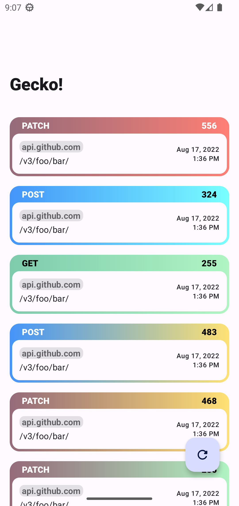

<p align="center">
  
</p>
<h1 align="center">Gecko</h1>

Gecko is a toolchain allowing for somewhat more pleasant development of API features. Its own
features vary by platform, where Android is getting the most love and a standalone application which
saves all content of all given requests/responses for later debugging.

## How does it work?

1) accepts metadata
   1) `GeckoMetadata[foo=bar,…]`
2) serializes them
   1) `M=bar…`
3) compresses them
   1) `????P?…`
4) base64 encodes them
   1) `gg3QH2Q==`
5) builds an url
   1) `https://diareuse.github.io/gecko/?q=gg3QH2Q==`
6) prints to output
   1) `V/System.out: https://diareuse.github.io/gecko/?q=gg3QH2Q==`

The frontend does the exact reverse and nothing more. You can check
the [repository](https://github.com/diareuse/gecko-fe) for more info.

You can always
just [try it out](https://diareuse.github.io/gecko/?q=H4sIAAAAAAAAAJ1UXW_aMBSVkj3xKyIet1ETQlmH1Id2rVRNZfSDbVVfkONcErdJbNlOKEP8912HhBYmoVEpL7m559xzjnPtZDfj-4nrFIkxUg8JoZIfxdwkRXjEREZiro0mfi_oHw8IFjLIjXad5IwxkGZIpUw5o4aLnJR51CDL4NOTFrnrpIPAdczbrnU9XLY8r23JpzxqD732ekL7sy2HIlrY2mjh6UKC8ugctMjAq-e3WyvXYb2u7zojpoAaiFxHXk0mN6TnOlcPnStIUzH8OKcl6I-te9AaJw_hhWYyhY5ev3eYEM8cXOfaD7p915n8q_K8UlkJ9CtluYigFjy6uHwZP0eSBXcXYc83j7-Pu6Pb09O1hUKltmlvqHQQhd0QWDDohuHJF_ja9082ERN_O4vvhTaNf57H3kwozyTgafoMnpi9-VQL0KAQZw3gWypinlsawYxAi1XPlrVdc7eDXw8_UvZ0edr00pIaqqY7zt644hmNQRNQSihSD5ommOoCvc8amljVROtJTXl_YNaNJjviE5Ole-TsdM8E_hNzpNmF7BtFNqhtGoz5HTSIWhKBp4Yp4ufVJhL7OxzEVyGWpN6fDZHGXBVEB1HVGBQ2z1HTkiiQ4pWxCDVTXNqlOEziFrKhEyqmOf9DD6dD5IbFKjwMXSEaOJR2wQ7CryFLIhUvKVusXpUw4CUm_g7OHWxDaRYSLMdPu8DNKXADUxpl1Q7PaKoB66tqz-v7b4o_OoLwTvQ73X7HP5n0giE-x4PH-j6Q0X_10cIkQk2p1oLx6pxs_7fx9fXZ-fjubDK-w9u35X74C9iU9Ts4BgAA)

<p float="left">
    
    
</p>

## Why is it useful?

Current methods of network request debugging are either directly dependant on Google Chrome, require
downloading additional apps written in bulky React, are an uncontrollable dependency madness or
simply do not grant you the immediate pleasure of **sharing buggy network request with your
colleague**.

I like none of these so I made my own. Include only the things you want or need and nothing more.
Modify every piece of the library as a user, _not as a contributor_.

## Download

JVM (level 11 compatible):

```groovy
repositories {
    mavenCentral()
}

dependencies {
    implementation "io.github.diareuse:gecko-core:+"
    implementation "io.github.diareuse:gecko-okhttp:+"
}
```

Android:

> Please note that JVM modules are also compatible with Android.

```groovy
repositories {
    mavenCentral()
}

dependencies {
    implementation "io.github.diareuse:gecko-android:+"
    debugImplementation "io.github.diareuse:gecko-android-ui:+"
}
```

# Usage

Since Gecko is designed from the ground up to be extremely modular and extendable, you have free
hand at what you can really do with it.

But let's just start simple.

## Startup

You will initialize Gecko like so:

```kotlin
fun getGecko(): Gecko {
    gecko()
    // or…
    gecko {
        domain = "your.domain.com" // optional
        encoder = Base64Encoder { … } // optional
        adapter = object : MetadataAdapter { … } // optional
        logger = Logger { … } // optional

        addStep { GeckoYourModule(it) } // optional
    }
}
```

If you're however starting gecko on Android, you should use:

```kotlin
fun Context.getGecko(): Gecko {
    geckoAndroid()
    // or…
    geckoAndroid {
        // same options as above
    }
}
```

## Network Logging

Gecko supports a Okhttp opt-in extension. It's a oversimplified logging class kanged
from [Square](https://github.com/square/okhttp/tree/master/okhttp-logging-interceptor) (thanks!).

```kotlin
val okhttp = OkHttpClient.Builder()
    // … more interceptors here
    .addInterceptor(GeckoInterceptor(gecko))
    .build()
```

> Fun fact: Gecko doesn't care whether you use REST or for example GraphQL. As long as you can
> serialize the body, it is possible to program an interceptor for that.

## Android (+ UI!)

All the heavy lifting is done for you. You need to only initialize gecko and provide a data source (
like OkHttp!). It's strongly suggested, though, to create a **debug and release source sets** where
in debug you would include Gecko.

> There are plans to create a "no-op" library which should reduce this strain. However due to the
> modularity it's rather inconvenient to duplicate all the code in a "no-op" flavor.

With solely the Android module (and not the `-ui`) you are free to use paging source to make your
own UI from scratch, to match your brand.

## Extendability

You can modify, bypass and add a new functionality of your own. Sky is the limit here.

### Domain

You can modify the domain to be hosted on your github, or your own web server. To do this you need
to deploy the clone of this [repository](https://github.com/diareuse/gecko-fe) and set
the [domain](gecko-core/src/main/java/gecko/builder/GeckoConfiguration.kt) variable to your own.

### Serialize

Create your own data format by implementing
the [`MetadataAdapter`](gecko-core/src/main/java/gecko/MetadataAdapter.kt) and providing in the
configuration.

> Beware! The integration with Gecko Frontend (and by extension the link builders) will not work
> when using a proprietary format!

### Compress

Compression is by default executed in a GZIP format. You can implement your own compression
mechanisms by implementing [`Gecko`](gecko-core/src/main/java/gecko/Gecko.kt). Please visit
the [builder](gecko-core/src/main/java/gecko/builder/GeckoBuilder.kt) to understand how to chain
Gecko together.

> Beware! The integration with Gecko Frontend (and by extension the link builders) will not work
> when using a proprietary compression method!

### Encode

The encoding used for passing data to the frontend is Base64 by choice. You can however swap the
encoding for something of your own.

> Beware! The integration with Gecko Frontend (and by extension the link builders) will not work
> when using a proprietary compression method!

### and more!

As mentioned before all you really need is the knowledge of chaining Gecko together and with it you
can do almost anything. Browse the current code for ideas, suggest new integrations and steps in the
issues!

Resources:

- [`Gecko`](gecko-core/src/main/java/gecko/Gecko.kt)
- [`GeckoBuilder`](gecko-core/src/main/java/gecko/builder/GeckoBuilder.kt)

## Building from source

You need JDK 11 to complete the build successfully.

> Never versions of the JDK are untested and can produce unwanted results.

```bash
./gradlew assemble publishToMavenLocal
```

```groovy
repositories {
    mavenLocal()
}

dependencies {
    implementation "io.github.diareuse:gecko-core:undefined"
    // and conversely the remaining modules…
}
```

Logo by <a href="https://www.flaticon.com/free-icons/gecko" title="gecko icons">Freepik</a>
